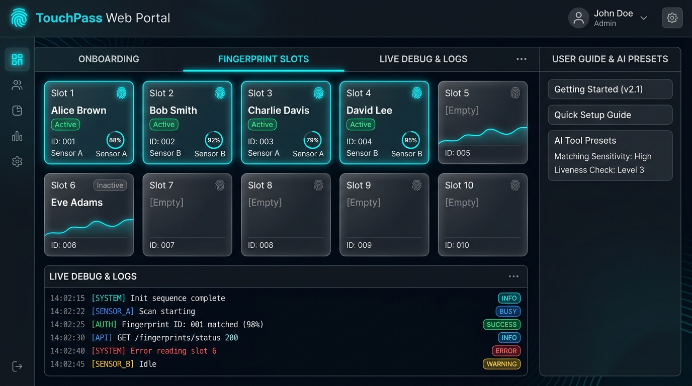
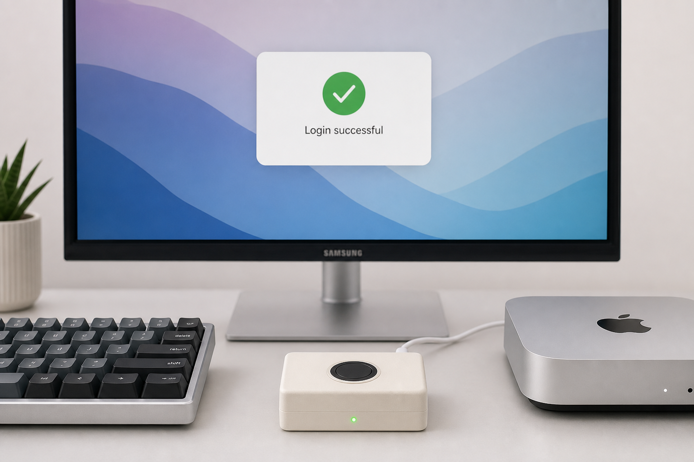
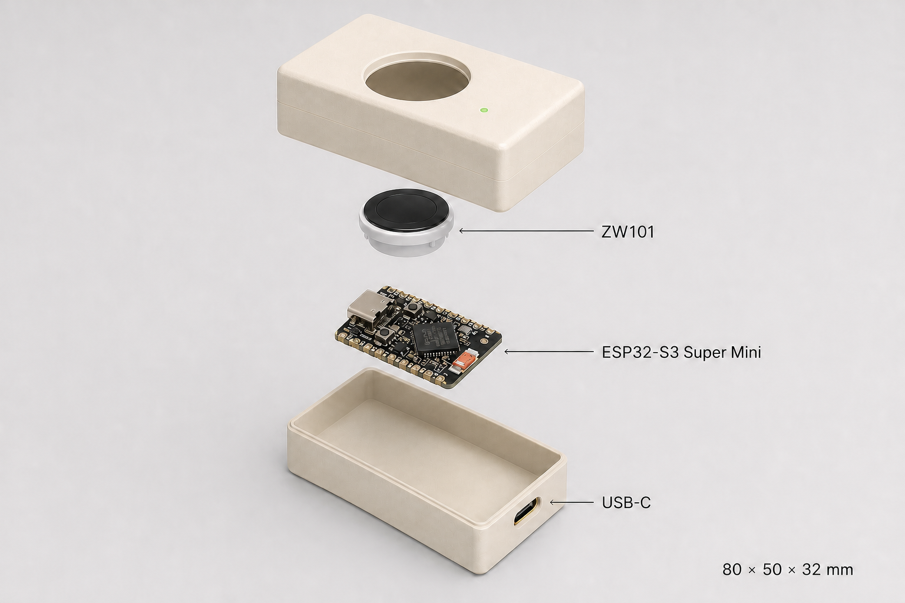

# TouchPass

> Give every finger a superpower.



## What is TouchPass?

**TouchPass** is an open-source **USB HID Native + Biometric Authentication Platform** powered by an **ESP32-S3 Super Mini** microcontroller and a **ZW101** optical fingerprint sensor.

It turns physical fingerprint touches into instant developer shortcuts, terminal command acceptances, password fills, and multi-step custom keyboard macros on your computer (macOS, Windows, or Linux). Direct hardware-level USB HID keyboard emulation means TouchPass works natively as a standard USB keyboard without requiring any custom HID target device drivers.

It combines hardware USB HID keyboard emulation, a local background helper service, and a browser-based management portal into a seamless personal command surface built on the open-source [ZimengXiong/TinyTouch](https://github.com/ZimengXiong/TinyTouch) platform.

---

## Key Features

- 🚀 **Self-Serve Onboarding Workflow**: Interactive 4-step wizard for immediate USB HID keyboard output testing, physical wiring setup, and initial finger enrollment.
- 🖐️ **10 Biometric Fingerprint Slots**: Map up to 10 fingers (Slots 01–10) to distinct shortcuts, password fills, or multi-step macros.
- ⚡ **Live Debug Log Monitor**: Real-time telemetry monitoring with color-coded event log badges (`TOUCH`, `MATCH`, `PW`, `ERR`, `SYS`) for instant hardware diagnostics.
- ⌨️ **Interactive Keyboard Shortcut Recorder**: Capture physical keystrokes and modifier key bitmasks (`Ctrl`, `Shift`, `Alt/Option`, `Cmd/Meta`) directly in the portal without manual code lookup.
- 🤖 **AI Developer Tools Shortcut Library**: Built-in 1-click preset library for top AI developer tools including Claude Code CLI, Cursor IDE, Claude Desktop, and Antigravity IDE.
- 🛡️ **Double-Touch Confirmation Safety**: Password execution runs on a single touch; non-password actions (Accept, Enter, Escape, Custom Macros) require touching the same finger **twice within 3 seconds** to prevent accidental command triggers.

---

## See It in Action


**Accept** sends only lowercase `y` + Return. Use it only in a focused terminal-style prompt that visibly expects that input; Touch Pass cannot click arbitrary GUI buttons. Accept and other non-password control actions need a deliberate confirmation: touch the same finger twice within three seconds.

### Visual Showcase





*Note: The "secure" language in this overview refers to local encrypted helper and OS Keychain handling. It does **not** mean TouchPass is a hardware secure enclave or that the sensor UART link is unauthenticated.*



---

## Quick Start Setup

TouchPass requires a Python 3.9+ runtime to run the local helper service and Web Portal (`http://127.0.0.1:8787/`).

### 1. Environment Setup

Clone the repository and prepare a local Python virtual environment:

#### Windows (PowerShell)
```powershell
python -m venv .venv
.\.venv\Scripts\Activate.ps1
pip install -r software\macos-helper\requirements.txt
```

#### macOS / Linux (Terminal)
```bash
python3 -m venv .venv
source .venv/bin/activate
pip install -r software/macos-helper/requirements.txt
```

### 2. Launching the Web Portal

Start the TouchPass helper service and open the local management portal in your browser:

#### Windows (1-Click Launcher - Recommended)
> 💡 **1-Click Launch**: On Windows, simply double-click **`start_touchpass.bat`** in the project root directory. It automatically launches the helper service and opens `http://127.0.0.1:8787/` in your default browser!

Or launch manually via PowerShell / Command Prompt:
```powershell
python run_portal_win.py
```

#### macOS / Linux
```bash
.venv/bin/python software/macos-helper/tinytouch_helper.py
```

Navigate to **`http://127.0.0.1:8787/`** in your web browser to open the TouchPass Web Portal.

---

## Firmware Compilation & Flashing

The TouchPass firmware runs on an ESP32-S3 board with native USB OTG enabled (`firmware/tiny_touch_keyboard`).

### Option A: Using `arduino-cli` (Command Line)

You can compile and flash the firmware directly using `arduino-cli`:

1. **Install ESP32 Core**:
   ```bash
   arduino-cli core update-index
   arduino-cli core install esp32:esp32
   ```

2. **Compile Firmware**:
   ```bash
   arduino-cli compile --fqbn esp32:esp32:esp32s3:CDCOnBoot=cdc,USBMode=tinyusb firmware/tiny_touch_keyboard
   ```

3. **Flash Firmware**:
   - **Windows**:
     ```powershell
     arduino-cli upload -p COM3 --fqbn esp32:esp32:esp32s3:CDCOnBoot=cdc,USBMode=tinyusb firmware/tiny_touch_keyboard
     ```
   - **macOS / Linux**:
     ```bash
     arduino-cli upload -p /dev/cu.usbmodem101 --fqbn esp32:esp32:esp32s3:CDCOnBoot=cdc,USBMode=tinyusb firmware/tiny_touch_keyboard
     ```

### Option B: Using Arduino IDE GUI

1. Open `firmware/tiny_touch_keyboard/tiny_touch_keyboard.ino` in Arduino IDE 2.x.
2. Select Board: **ESP32S3 Dev Module**.
3. Configure settings:
   - **USB Mode**: `USB-OTG (TinyUSB)`
   - **USB CDC On Boot**: `Enabled`
   - **Flash Size**: `4MB`
   - **PSRAM**: `Disabled`
4. Click **Verify**, then **Upload**.

For full wiring schematics and initial key pairing configuration, refer to the [TouchPass Build Guide](docs/BUILD_GUIDE.md).

---

## Directory Structure Overview

```text
TouchPass/
├── assets/                  # Documentation images, hero showcases, and diagrams
├── docs/                    # Project documentation & guides
│   ├── BUILD_GUIDE.md       # Hardware wiring, parts list, enclosure & firmware build guide
│   ├── USER_GUIDE.md        # Comprehensive user manual, AI presets, & portal guide
│   └── esp32-s3-zw101-portal-vi.md  # Vietnamese hardware & portal setup guide
├── firmware/                # Microcontroller firmware source code
│   ├── tiny_touch_keyboard/ # Primary Arduino firmware sketch for ESP32-S3 + ZW101 HID
│   └── tiny_touch_smartcard/# ESP-IDF alternative unified factory firmware
├── hardware/                # Physical enclosure files
│   └── case/                # 3D printable STL enclosure models (case_top.stl, case_bottom.stl)
├── packaging/               # Standalone application build scripts
├── software/                # Local helper & portal backend software
│   └── macos-helper/        # Python service, Keychain manager, and web portal API
├── tests/                   # Python automated unit and documentation test suite
├── run_portal_win.py        # Windows runner script for TouchPass Web Portal
├── start_touchpass.bat      # 1-click launcher batch script for Windows
└── README.md                # Project documentation overview
```

---

## Supported Action Types

TouchPass natively supports standard USB HID keyboard actions:

| Action Type | Description & Example |
| :--- | :--- |
| **Text** | Types a standard ASCII text string into the focused field. |
| **Key** | Sends specific single keystrokes or hotkeys (e.g. Enter, Escape, `Ctrl+C`). |
| **Delay** | Pauses execution for a specified millisecond duration within custom macros. |
| **Password** | Securely fetches credentials from OS Keychain and types them into focused fields. |

---

## Security & Safety

- **Focused Input Safety**: TouchPass acts as a standard USB HID keyboard. Keystrokes are typed directly into whichever application window currently has cursor focus. Always check focused cursor position before placing a finger on the sensor ring.
- **Unauthenticated UART Hardware Link**: The physical UART communication link between the ZW101 fingerprint sensor and the ESP32-S3 microcontroller is unauthenticated. Ensure physical access to the device hardware is controlled.
- **Keychain Storage**: Passwords are securely stored in the native operating system Keychain (macOS Keychain / Windows Credential Manager) and encrypted over serial.

---

## Documentation & Guides

- 🛠️ [Build TouchPass](docs/BUILD_GUIDE.md) — Hardware parts, wiring diagram, soldering, and firmware setup.
- 📖 [Use TouchPass](docs/USER_GUIDE.md) — Complete user guide, fingerprint enrollment, shortcut recorder, and AI tool presets.
- 🇻🇳 [Hướng dẫn phần cứng bằng tiếng Việt](docs/esp32-s3-zw101-portal-vi.md) — Detailed hardware & portal guide in Vietnamese.

---

## Built on TinyTouch

TouchPass is built on [ZimengXiong/TinyTouch](https://github.com/ZimengXiong/TinyTouch), the open-source foundation for fingerprint biometric processing and USB HID emulation. If TinyTouch helps your workflow, consider supporting the upstream project!
