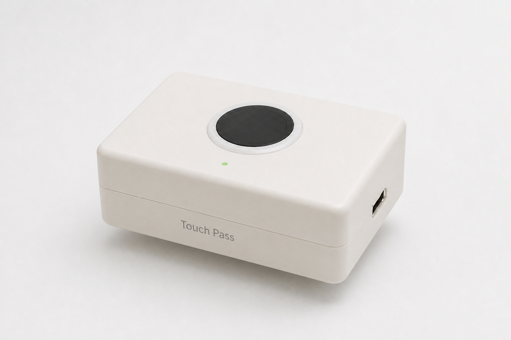

[🌐 **English**](README.md) | 🇻🇳 **Tiếng Việt** | [🌐 **1-Click Web Flasher**](https://tody-agent.github.io/Touch-Pass/web/flasher/) | [🤖 **Cài đặt AI Agent 1-Prompt**](docs/AI_AGENT_PROMPT.md)

> **Cho mỗi ngón tay một siêu năng lực.**

[](LICENSE)
[](docs/BUILD_GUIDE.md)
[](https://python.org)
[](https://tody-agent.github.io/Touch-Pass/web/flasher/)
[](docs/AI_AGENT_PROMPT.md)



---

## ⚡ Câu chuyện: Tại sao TouchPass ra đời?

Hãy hình dung kịch bản này: Bạn đang chìm đắm trong trạng thái tập trung cao độ (Flow state), lập trình một tính năng phức tạp cùng các trợ lý AI như **Claude Code CLI**, **Cursor**, hay **Antigravity**.

Cứ 30 giây, cửa sổ terminal lại dừng lại và hỏi:
> *"Bán có cho phép thực thi `git status` không? (y/n)"*

Bạn phải rời tay khỏi luồng tư duy, với tay gõ `y`, nhấn `Enter`, rồi quay lại đọc dòng code tiếp theo. Vừa chạy được 20 giây: *`Yêu cầu mật khẩu Sudo`*. Bạn lại ngắt nhịp, cặm cụi gõ từng ký tự của mật khẩu 20 ký tự phức tạp, vừa gõ vừa nơm nớp lo bị gõ sai ký tự.

**Những sự ngắt quãng nhỏ đó chính là "kẻ sát nhân" tiêu diệt sự tập trung của lập trình viên.**

Đó là lý do **TouchPass** ra đời.

Sẽ ra sao nếu trên bàn làm việc của bạn có một thiết bị xác thực sinh trắc học thông minh — nơi **mỗi ngón tay đại diện cho một siêu năng lực**?
- ☝️ **Ngón trỏ**: Chấp nhận ngay câu lệnh gợi ý của AI terminal (`y` + Enter) chỉ với 1 cú chạm.
- 🖕 **Ngón giữa**: Tự động điền mật khẩu sudo/SSH an toàn từ kho bảo mật hệ điều hành mà không cần gõ phím.
- 🖐️ **Ngón áp út**: Kích hoạt chuỗi phím tắt macro đa bước tùy chỉnh riêng của bạn.

Không cần chuyển đổi ứng dụng. Không cần copy-paste mật khẩu. Không bao giờ gõ sai phím. Chỉ **một chạm nhẹ**, phần cứng TouchPass sẽ tự động gõ lệnh với tốc độ ánh sáng!

---

## 🎯 Giải pháp: Khi Phần Cứng Độc Lập Kết Hợp Sinh Trắc Học

**TouchPass** là nền tảng **Mã hóa Sinh trắc học & Giả lập Bàn phím USB HID Native** mã nguồn mở được vận hành bởi vi điều khiển **ESP32-S3 Super Mini** và cảm biến vân tay optical **ZW101**.

Khác với các ứng dụng phần mềm ghi phím tắt thông thường yêu cầu cài đặt phần mềm phụ trợ trên thiết bị đích, TouchPass hoạt động trực tiếp ở **cấp độ phần cứng**:

```text
┌───────────────────────┐             ┌───────────────────────┐             ┌───────────────────────┐
│ Cảm biến vân tay ZW101│ ──────────► │ Hardware ESP32-S3     │ ──────────► │ Máy tính / Terminal   │
│ (Xác thực sinh trắc)  │             │ (Giả lập Bàn phím HID)│             │ (Tự động gõ phím)     │
└───────────────────────┘             └───────────────────────┘             └───────────────────────┘
```

Máy tính của bạn nhận diện TouchPass như một **bàn phím USB phần cứng thực thụ**. Nó tự động gõ văn bản (`text`), gửi tổ hợp phím (`key`), tạm dừng (`delay`), hoặc tự động điền mật khẩu (`password`) vào đúng cửa sổ ứng dụng đang focus — **không cần cài đặt bất kỳ driver thiết bị HID nào**.

---

## 🚀 Các Kịch Bản Sử Dụng Hấp Dẫn (Use Cases)

### 1. 🤖 Tăng tốc Lập trình cùng Trợ lý AI (AI Pair Programming)
Khi làm việc với các công cụ CLI AI như Claude Code, việc chấp nhận gợi ý lệnh đòi hỏi phải bấm `y` và `Enter` liên tục.


> **Cách hoạt động:** Khi terminal hỏi xác nhận, bạn chỉ cần chạm nhẹ ngón tay đã đăng ký. TouchPass gửi tín hiệu bàn phím HID gõ chữ `y` tiếp nối bởi phím Enter directly vào terminal-style prompt của bạn. Lưu ý: TouchPass gửi phím gõ HID chuẩn vào cửa sổ đang focus; thiết bị không thể click hoặc bấm vào các nút giao diện đồ họa GUI.

### 2. 🔑 Điền Mật Khẩu Lập Trình Viên An Toàn Trong 1 Giây
Bạn mệt mỏi vì phải nhập đi nhập lại mật khẩu `sudo`, SSH key, hay tài khoản môi trường staging?
- TouchPass lấy mật khẩu an toàn từ Kho bảo mật hệ thống (Windows Credential Manager / macOS Keychain).
- Dữ liệu được mã hóa qua đường truyền serial bằng thuật toán HMAC-SHA256 và AES-CTR.
- Phần cứng tự động gõ chính xác mật khẩu trong chớp mắt mà không bao giờ bị sai ký tự.

### 3. ⌨️ Ghi & Kích Hoạt Phím Tắt Macro Đa Bước Tùy Chỉnh
Cấu hình tối đa 10 slot vân tay sinh trắc (Slot 01–10) với các hành động linh hoạt:
- **Hành động Phím (Key)**: Gửi phím đơn hoặc tổ hợp phím như `Enter`, `Escape`, `Ctrl+C`, `Cmd+K`.
- **Hành động Văn bản (Text)**: Gõ các đoạn code mẫu, cờ git lệnh, hoặc mẫu email thường dùng.
- **Hành động Trễ (Delay)**: Thêm khoảng dừng millisecond giữa các bước gõ trong chuỗi macro phức tạp.

### 4. 🛡️ Cơ Chế An Toàn Chạm Kép (Double-Touch Guard)
Bạn lo lắng việc lỡ tay chạm vào cảm biến sẽ vô tình thực thi lệnh ngoài ý muốn? TouchPass tích hợp bộ quy tắc an toàn thông minh:
- **Hành động Mật khẩu**: Kích hoạt ngay sau 1 lần chạm.
- **Hành động Phím & Macro** (`Enter`, `Escape`, `Accept`, Custom Macro): Bắt buộc chạm cùng ngón tay đó **2 lần liên tiếp trong 3 giây** để xác nhận trước khi thực thi phím gõ.

---

## 💎 Giá Trị Vượt Trội Dành Cho Lập Trình Viên

- 🚀 **Tương thích Tuyệt đối Plug & Play**: Hoạt động tức thì trên Windows, macOS và Linux như một bàn phím USB tiêu chuẩn.
- 🔐 **Bảo mật Tuyệt đối & Zero-Cloud**: Tất cả mẫu vân tay được quét và khớp hoàn toàn cục bộ trên vi mạch ZW101. Không có bất kỳ dữ liệu vân tay hay mật khẩu nào bị gửi lên đám mây.
- ⚡ **Web Portal & Telemetry Real-time**: Đi kèm giao diện Web Portal (`http://127.0.0.1:8787/`) với **Trình ghi phím tắt Shortcut Recorder** và **Nhật ký live Debug Console**.
- 🛠️ **Mã Nguồn Mở & Tùy Biến Không Giới Hạn**: Phát triển trên nền tảng open-source [ZimengXiong/TinyTouch](https://github.com/ZimengXiong/TinyTouch).

---

## 🎬 Trải Nghiệm Giao Diện Web Portal


- **Quy trình Onboarding 4 bước**: Hoàn tất cài đặt chỉ trong 5 phút với các bước hướng dẫn tương tác trực quan.
- **Thư viện AI Preset**: Tích hợp sẵn mẫu phím tắt 1-click cho Claude Code CLI, Cursor IDE, Claude Desktop và Antigravity IDE.
- **Giám sát sự kiện phần cứng real-time**: Theo dõi trạng thái kết nối với các badge sự kiện (`TOUCH`, `MATCH`, `PW`, `ERR`, `SYS`).

---

## 📖 Thư Viện Tài Liệu Chi Tiết

Bạn đã sẵn sàng tự tay chế tạo thiết bị TouchPass hoặc khám phá các tùy chỉnh nâng cao? Hãy truy cập các bộ hướng dẫn chi tiết dưới đây:

- 🤖 **[Hướng Dẫn Cài Đặt AI Agent 1-Prompt](docs/AI_AGENT_PROMPT.md)**
  *Quy trình tự động hóa cài đặt 1-prompt cho Claude Code, Cursor, Antigravity và OpenCode trên Windows, macOS và Linux.*

- 🛠️ **[Hướng Dẫn Lắp Ráp & Đấu Nối (Tiếng Anh)](docs/BUILD_GUIDE.md)** | **[🇻🇳 Bản Tiếng Việt](docs/BUILD_GUIDE.vi.md)**
  *Sơ đồ đấu nối chân ZW101 ➔ ESP32-S3, đóng vỏ enclosure, biên dịch firmware `arduino-cli`, và script 1-click launcher trên Windows.*

- 📖 **[Cẩm Nang Sử Dụng & AI Presets (Tiếng Anh)](docs/USER_GUIDE.md)** | **[🇻🇳 Bản Tiếng Việt](docs/USER_GUIDE.vi.md)**
  *Hướng dẫn đăng ký vân tay, trình ghi phím tắt tương tác, quy tắc an toàn chạm kép, quản lý mật khẩu Credential Manager và xử lý sự cố.*

---

## ⚖️ Bản Quyền & Lời Cảm Ơn

TouchPass là phần mềm mã nguồn mở được phát hành theo giấy phép MIT License. Dự án được xây dựng với tình yêu công nghệ dựa trên kiến trúc nền tảng của [ZimengXiong/TinyTouch](https://github.com/ZimengXiong/TinyTouch).

---

## 🛡️ Chính Sách Bảo Mật & Tuyên Bố Miễn Trừ Trách Nhiệm / Security Policy & Legal Disclaimer

TouchPass được cung cấp **"NGUYÊN TRẠNG" (AS IS)** và không có bất kỳ bảo hành nào dưới bất kỳ hình thức nào. Người dùng tự chịu toàn bộ trách nhiệm đối với việc lắp ráp phần cứng vật lý, kiểm tra sơ đồ đấu nối dây, điện áp hoạt động (an toàn nguồn 3.3V so với 5V), hiệu chuẩn cảm biến vân tay quang học và bảo đảm an toàn truy cập vật lý cho thiết bị. TouchPass tích hợp trực tiếp với kho lưu trữ chứng thư bảo mật của hệ điều hành (Windows Credential Manager / macOS Keychain / Linux Secret Service) và giao tiếp qua Serial UART sử dụng xác thực HMAC-SHA256.

TouchPass is provided **"AS IS"**, without warranty of any kind, express or implied. Users assume full responsibility for physical hardware assembly, wiring diagram verification, voltage levels (3.3V vs 5V safety), optical biometric sensor calibration, and maintaining physical device security.

Để biết chi tiết về kiến trúc bảo mật, các phiên bản được hỗ trợ, quy trình báo cáo lỗ hổng bảo mật và toàn văn tuyên bố miễn trừ trách nhiệm pháp lý, vui lòng tham khảo **[Chính Sách Bảo Mật (SECURITY.md)](SECURITY.md)**.

For full security architecture details, supported versions, vulnerability reporting procedures, and complete legal disclaimers, please review our **[Security Policy & Legal Disclaimer (SECURITY.md)](SECURITY.md)**.

