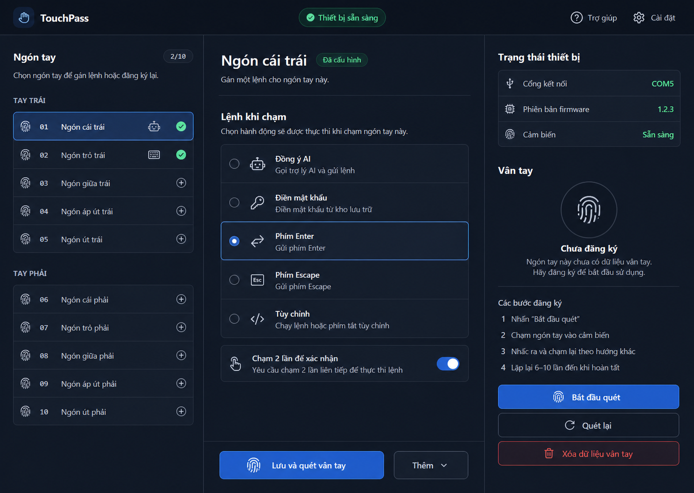

# Cẩm Nang Sử Dụng TouchPass

[🌐 **English**](USER_GUIDE.md) | 🇻🇳 **Tiếng Việt** | [🇨🇳 **简体中文**](USER_GUIDE.zh.md) | [🇷🇺 **Русский**](USER_GUIDE.ru.md)

Chào mừng bạn đến với Cẩm nang sử dụng chính thức của **TouchPass** — nền tảng tự động hóa phím tắt macro và xác thực sinh trắc học nguồn mở chạy trên vi điều khiển ESP32-S3 và cảm biến vân tay ZW101.

---

## Mục Lục

1. [Phân biệt Kiến trúc: Firmware và Local Helper](#1-phan-biet-kien-truc-firmware-va-local-helper)
2. [Tổng Quan Nền Tảng TouchPass](#2-tong-quan-nen-tang-touchpass)
3. [Hướng Dẫn Tự Cài Đặt (Self-Serve Onboarding)](#3-huong-dan-tu-cai-dat-self-serve-onboarding)
4. [Trình Ghi Phím Tắt Tương Tác (Shortcut Recorder)](#4-trinh-ghi-phim-tat-tuong-tac-shortcut-recorder)
5. [Thư Viện Phím Tắt Mẫu AI Developer Tools](#5-thu-vien-phim-tat-mau-ai-developer-tools)
6. [Nhật Ký Live Debug Console](#6-nhat-ky-live-debug-console)
7. [Danh Mục Kiểm Tra An Toàn & Bảo Mật](#7-danh-muc-kiem-tra-an-toan--bao-mat)
8. [Xử Lý Sự Cố Thường Gặp](#8-xu-ly-su-co-thuong-gap)

---

## 1. Phân biệt Kiến trúc: Firmware và Local Helper

TouchPass được thiết kế theo kiến trúc phân tách rõ ràng giữa **Firmware phần cứng (ESP32-S3)** và **Local Helper (Phần mềm trên máy tính)** nhằm mang lại khả năng phản hồi tức thì qua USB HID phần cứng và độ an toàn bảo mật cao cho dữ liệu sinh trắc học & mật khẩu.

### Sơ Đồ Luồng Dữ Liệu

```text
┌─────────────────────────┐
│ Cảm biến vân tay ZW101  │ (Quét & nhận diện vân tay ZW101)
└────────────┬────────────┘
             │ UART Serial (Matching Slot / IRQ Trigger)
             ▼
┌─────────────────────────┐
│ ESP32-S3 Firmware       │
│ (tiny_touch_keyboard)   │
└──────┬───────────▲──────┘
       │           │
  USB  │           │ USB Keyboard Output
Serial │           │ (HID Keystrokes gõ phím trực tiếp)
       ▼           │
┌──────────────────┴──────┐
│ Python Local Helper     │ (run_portal_win.py / tinytouch_helper.py)
│ (http://127.0.0.1:8787) │
└────────────┬────────────┘
             │ Truy xuất mật khẩu an toàn (API RPC)
             ▼
┌─────────────────────────┐
│ OS Credential Store     │ (Windows Credential Manager / macOS Keychain)
└─────────────────────────┘
```

- **ESP32-S3 Firmware**: Chịu trách nhiệm giao tiếp UART tốc độ cao với ZW101, điều khiển màu đèn LED, xác thực mã HMAC-SHA256, giải mã AES-CTR và tự đóng vai trò bàn phím USB HID gõ phím trực tiếp vào máy tính.
- **Local Helper Service**: Quản lý giao diện Web Portal `http://127.0.0.1:8787/`, nhận yêu cầu đăng ký vân tay và truy xuất mật khẩu an toàn từ kho Credential của hệ điều hành (Windows Credential Manager / macOS Keychain).

---

---

## 2. Trải Nghiệm Ứng Dụng Native Desktop App (macOS, Windows, Linux)

TouchPass trang bị ứng dụng Desktop native hoàn chỉnh, hiện đại được xây dựng trên nền tảng **Rust + Tauri v2 + Svelte 5**.

<div align="center">



*Giao diện TouchPass Desktop Native: Sơ đồ 10 ngón tay sinh trắc học trực quan, trạng thái kết nối phần cứng thời gian thực và cấu hình phím tắt AI nhanh chóng.*

</div>

### Các Tính Năng Nổi Bật Trên Giao Diện:
1. **Sơ Đồ Bàn Tay Sinh Trắc Học Tương Tác (Biometric Hand Map)**:
   - Hiển thị trực quan toàn bộ 10 ngón tay cho Bàn tay Trái (Út ➔ Cái) và Bàn tay Phải (Cái ➔ Út).
   - Đổi màu trạng thái theo thời gian thực (đã đăng ký vân tay, đã gán phím tắt, hoặc đang chờ thao tác).
2. **Dò Cổng Tự Động & Bảng Giám Sát Phần Cứng**:
   - Tự động quét và kết nối cổng COM / tty với vi điều khiển ESP32-S3.
   - Hiển thị tình trạng bắt tay mã khóa bảo mật HMAC và tốc độ baud rate.
3. **Gán Phím Tắt & Mật Khẩu 1-Click**:
   - **Chấp nhận Prompt AI**: Tự động gõ `y` + `Enter` để duyệt lệnh nhanh chóng trong terminal của Claude Code, Cursor, Antigravity.
   - **Tự động điền Mật khẩu**: Truy xuất an toàn mật khẩu sudo/SSH từ kho khóa OS Keyring.
   - **Ghi Macro Phím tắt Tùy chỉnh**: Ghi lại chuỗi tổ hợp phím và độ trễ theo nhu cầu cá nhân.
4. **Trải Nghiệm Nhất Quán Đa Nền Tảng**:
   - Hoạt động mượt mà với đầy đủ tính năng trên **macOS**, **Windows (10/11)**, và **Ubuntu/Debian Linux**.

---

## 3. Quy Tắc & Giới Hạn Hành Động

### Giới hạn & Quy tắc Hành động
- **Độ dài hành động tối đa**: Mỗi slot hỗ trợ tối đa **16 bước (16 steps)** hoặc tối đa **256 encoded bytes**. Nếu chuỗi phím vượt quá 256 bytes, hệ thống sẽ báo lỗi và từ chối lưu.
- **Cơ chế An toàn Chạm kép (Double-Touch Confirmation)**: 
  - Mật khẩu: Kích hoạt ngay sau **1 lần chạm**.
  - Các phím điều khiển (Accept, Enter, Escape, Custom Macro): Bắt buộc chạm lại ngón tay đó **lần 2 trong vòng 3 giây** để xác nhận, tránh việc bấm nhầm lệnh ngoài ý muốn.

---

## 3. Hướng Dẫn Tự Cài Đặt (Self-Serve Onboarding)

Web Portal tích hợp sẵn bộ hướng dẫn tương tác 4 bước:

1. **Bước 1: Kiểm tra Gõ phím USB HID** — Xác nhận máy tính đã nhận diện ESP32-S3 là bàn phím HID.
2. **Bước 2: Kiểm tra Đấu nối Phần cứng** — Kiểm tra đường truyền UART giữa ESP32-S3 và cảm biến ZW101.
3. **Bước 3: Đăng ký Vân tay Đầu tiên** — Đăng ký ngón tay vào Slot 01.
4. **Bước 4: Gán Hành động Ban đầu** — Gán phím tắt hoặc mật khẩu cho slot vừa đăng ký.

---

## 4. Trình Ghi Phím Tắt Tương Tác (Shortcut Recorder)

Trình ghi phím tắt trực quan trên Web Portal cho phép bạn:
- Bấm tổ hợp phím bất kỳ trên bàn phím thực (bao gồm phím modifier `Ctrl`, `Shift`, `Alt/Option`, `Cmd/Meta`).
- Hệ thống tự động ghi lại mã keycode và modifier bitmask.
- Bấm **Lưu hành động (Save Action)** để nạp ngay vào thiết bị.

---

## 5. Thư Viện Phím Tắt Mẫu AI Developer Tools

Tích hợp sẵn phím tắt 1-click cho các công cụ lập trình AI hàng đầu:

- 🤖 **Claude Code CLI**: `y` + `Enter` (Chấp nhận prompt lệnh trong terminal)
- 💻 **Cursor IDE**: `Cmd+K` / `Ctrl+K` (Mở cửa sổ AI Edit code)
- 🖥️ **Claude Desktop**: `Cmd+Space` / `Ctrl+Space` (Mở nhanh AI Assistant)
- 🚀 **Antigravity IDE**: `Ctrl+Shift+A` (Mở cửa sổ điều khiển Agentic AI)

---

## 6. Nhật Ký Live Debug Console

Giao diện Web Portal hiển thị nhật ký sự kiện real-time với các badge màu:
- 🟢 `TOUCH`: Phát hiện có ngón tay chạm vào cảm biến ZW101.
- 🔵 `MATCH`: Vân tay khớp với Slot ID đã đăng ký.
- 🔑 `PW`: Lấy mật khẩu từ kho Credential hệ thống và gõ tự động.
- 🔴 `ERR`: Báo lỗi chữ ký HMAC không hợp lệ hoặc lỗi phần cứng.
- ⚪ `SYS`: Cập nhật trạng thái hệ thống / kết nối lại cổng serial.

---

## 7. Danh Mục Kiểm Tra An Toàn & Bảo Mật

- **Chế độ Đăng nhập Hệ điều hành**:
  - **Chế độ Thẻ Thông Minh PIV Native (Khuyến nghị)**: Cho phép đăng nhập và mở khóa khởi động lạnh trực tiếp. macOS Apple Silicon hỗ trợ mở khóa FileVault cold boot; macOS Apple T2/Intel hỗ trợ Login Window và lệnh sudo; Windows hỗ trợ đăng nhập Domain Active Directory và Microsoft Entra ID CBA. Hoàn toàn không lưu mật khẩu hệ điều hành trong firmware. Chi tiết xem **[Hướng dẫn macOS PIV & FileVault](macos-piv-filevault-guide.md)** và **[Hướng dẫn Windows Smart Card](windows-piv-cba-guide.md)**.
  - **Chế độ Gõ Phím USB HID**: Hỗ trợ mở khóa session và tự động gõ mật khẩu/macro khi phiên làm việc của người dùng đã hoạt động và ứng dụng helper đang chạy.

---

## 8. Xử Lý Sự Cố Thường Gặp

| Sự cố | Nguyên nhân | Cách khắc phục |
| :--- | :--- | :--- |
| Web Portal báo `Disconnected` | Cổng serial chưa được mở | Kiểm tra lại dây USB Data và đảm bảo `USB CDC On Boot` đã được bật trong firmware. |
| Đèn LED cảm biến không sáng | Lỗi cấp nguồn | Kiểm tra lại chân `V_TOUCH` và `VCC` đã nối đúng vào `3V3` chưa. |
| Không lưu được phím tắt | Vượt quá giới hạn | Đảm bảo chuỗi macro không quá 16 bước và dưới 256 bytes. |

---

## 9. 🛡️ Chính Sách Bảo Mật & Tuyên Bố Miễn Trừ Trách Nhiệm / Security Policy & Legal Disclaimer

TouchPass được cung cấp **"NGUYÊN TRẠNG" (AS IS)** và không có bất kỳ bảo hành nào dưới bất kỳ hình thức nào. Người dùng tự chịu toàn bộ trách nhiệm đối với việc lắp ráp phần cứng vật lý, kiểm tra sơ đồ đấu nối dây, an toàn điện áp, hiệu chuẩn cảm biến vân tay quang học và bảo đảm an toàn truy cập vật lý cho thiết bị.

TouchPass is provided **"AS IS"**, without warranty of any kind, express or implied. Users assume full responsibility for physical hardware assembly, wiring diagram verification, voltage levels (3.3V vs 5V safety), optical biometric sensor calibration, and maintaining physical device security.

- 🇻🇳 **Tiếng Việt**: Chi tiết về quy trình báo cáo lỗ hổng, các phiên bản hỗ trợ và miễn trừ trách nhiệm pháp lý, vui lòng tham khảo **[Chính Sách Bảo Mật (SECURITY.vi.md)](translations/SECURITY.vi.md)**.
- 🇺🇸 **English**: For full security architecture details, supported versions, vulnerability reporting, and limitation of liability, see **[Security Policy & Legal Disclaimer (SECURITY.md)](../SECURITY.md)**.
- 🇨🇳 **简体中文**: **[安全策略与法律声明 (SECURITY.zh.md)](translations/SECURITY.zh.md)**.
- 🇷🇺 **Русский**: **[Политика безопасности (SECURITY.ru.md)](translations/SECURITY.ru.md)**.
