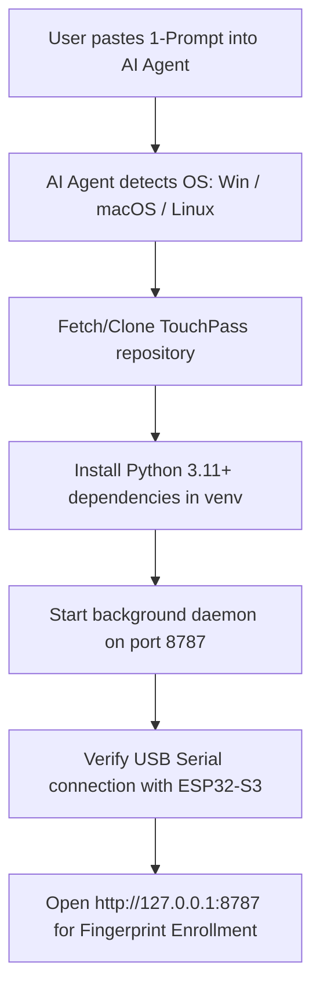

# TouchPass Distribution System: 1-Click Web Flasher & 1-Prompt AI Agent Setup

**Date:** 2026-08-13  
**Status:** Approved  
**Author:** TouchPass Team & Antigravity  

---

## 1. System Overview & Architecture

TouchPass is a hardware biometric superpower device built on **ESP32-S3** and **ZW101/ZW111** fingerprint sensors that sends native USB HID keyboard keystrokes to accept AI developer CLI prompts (`y` + `Enter`) and enter developer credentials/macros.

To achieve maximum accessibility for both **non-tech users** and **AI developer agents**, TouchPass provides a 3-tier distribution strategy:

```text
┌─────────────────────────────────────────────────────────────────────────────────┐
│                           TOUCHPASS DISTRIBUTION SYSTEM                         │
├───────────────────────────────┬────────────────────────────────┬────────────────┤
│  1. 🌐 GitHub Pages Flasher   │  2. 🖥️ Desktop Installers      │ 3. 🤖 AI Agent │
│   (1-Click Web Serial API)    │   (Win .exe / Mac App & Script)│   (1 Prompt)   │
├───────────────────────────────┼────────────────────────────────┼────────────────┤
│ · Chrome / Edge / Brave       │ · Portable Windows .exe        │ · Claude Code  │
│ · Direct USB flashing         │ · macOS DMG / LaunchAgent      │ · Cursor       │
│ · Zero driver / python setup  │ · System tray + Web Portal     │ · Antigravity  │
│ · Live progress & BOOT guide  │ · Local Web UI (port 8787)     │ · OpenCode     │
└───────────────────────────────┴────────────────────────────────┴────────────────┘
```

---

## 2. GitHub Pages All-in-One Web Flasher (`web/flasher/`)

### 2.1 Web Page Structure & Layout (`index.html`)
The GitHub Pages website is styled with a premium dark theme (`#121815` background, `#22c55e` green accents, fluid typography) and contains 4 main sections:

1. **Hero Section**:
   - Title: **TouchPass** — *Give every finger a superpower.*
   - Subtitle: 1-Click Hardware Flasher & Setup Portal for AI Developers & Non-Tech Users.
   - Interactive SVG/Image diagram showing fingerprint touch triggering instant AI prompt approval (`y + Enter`).

2. **1-Click Web Serial Flasher Component**:
   - Target Hardware selector (ESP32-S3 SuperMini / Seeed XIAO ESP32-S3).
   - Large prominent **"⚡ Connect & Flash Firmware"** button using Web Serial API (`navigator.serial`).
   - Real-time progress bar with stage indicator (`Checking Integrity` ➔ `Connecting` ➔ `Erasing` ➔ `Writing Firmware (0-100%)`).
   - Diagnostic technical log drawer for advanced debugging.
   - Friendly troubleshooting popovers (e.g. "Board not found? Hold BOOT, tap RESET, release BOOT").

3. **Desktop Apps & Downloads Section**:
   - 1-Click download buttons for Windows (`TouchPass_Setup.exe` / `start_touchpass.bat`) and macOS (`TouchPass.dmg` / `install.sh`).

4. **1-Prompt AI Agent Integration Section**:
   - Interactive code block with 1-click **"Copy Prompt"** button for AI coding agents.

### 2.2 Flashing Engine Specification (`app.js` & `esptool-js`)
- **Transport**: Web Serial API (`navigator.serial`).
- **Baud Rate**: `460800` baud for high-speed flashing.
- **Binary Binaries & Memory Map**:
  - `0x00000`: `bootloader.bin`
  - `0x08000`: `partition-table.bin`
  - `0x10000`: `tiny_touch_smartcard.bin` (Unified Firmware)
- **Integrity Protocol**: Pre-flashing SHA-256 validation of all binary files using `window.crypto.subtle.digest`.
- **Reset Automation**: Automated `hard_reset` call post-flashing to reboot ESP32-S3 directly into production HID mode.

---

## 3. Desktop Standalone Packaging for Non-Tech Users (`packaging/`)

### 3.1 Windows Package
- **Format**: Portable Standalone Executable (`TouchPass.exe`) or One-Click Batch Launcher (`start_touchpass.bat`).
- **Functionality**:
  - Launches local Python daemon on `127.0.0.1:8787`.
  - Minimizes into System Tray with options: *Open Web Portal*, *View Logs*, *Exit*.
  - Automatically opens default browser to `http://127.0.0.1:8787/`.

### 3.2 macOS Package
- **Format**: Executable Application / Shell Installer (`install.sh`).
- **Functionality**:
  - Auto-installs lightweight daemon into `~/Library/LaunchAgents/com.touchpass.daemon.plist` for background persistence.
  - Automatically opens Web Portal at `http://127.0.0.1:8787/`.

---

## 4. 1-Prompt AI Agent Integration (`docs/AI_AGENT_PROMPT.md`)

### 4.1 Automated AI Agent Execution Flow
When an AI agent (Claude Code, Cursor, Antigravity, etc.) receives the TouchPass 1-Prompt instruction, it follows this deterministic workflow:



### 4.2 Standardized Copy-Paste AI Agent Prompt Template
```markdown
Set up TouchPass on my computer for AI CLI automation:
1. Detect my OS (Windows/macOS/Linux) and verify Python 3.11+ is installed.
2. Clone repository https://github.com/ZimengXiong/TinyTouch.git or use local files.
3. Install dependencies from software/requirements.txt inside a virtual environment.
4. Launch the local daemon (python run_portal_win.py or software/app.py) in the background on port 8787.
5. Verify hardware USB connection to ESP32-S3 and confirm Web Portal is reachable at http://127.0.0.1:8787/.
```

---

## 5. Verification & Testing Plan

1. **Web Serial Flasher Verification**:
   - Validate on Google Chrome and Microsoft Edge on Windows 11 and macOS Sonoma.
   - Verify SHA-256 check prevents corrupted flash attempts.
   - Test fallback recovery guidance when device is not in BOOT mode.

2. **Desktop Launcher Verification**:
   - Run `start_touchpass.bat` on Windows to verify Python virtual environment setup and Web Portal launch on port 8787.
   - Verify zero crash output in `run_test_gate.py`.

3. **AI Agent Verification**:
   - Test execution of the 1-prompt block using Antigravity CLI and Claude Code CLI.
