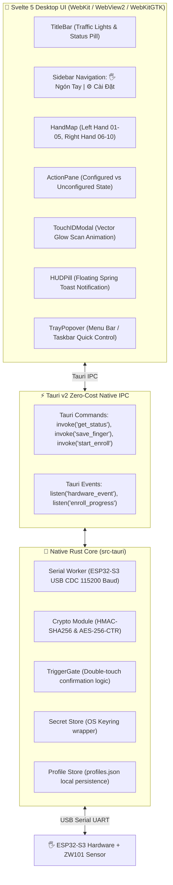

# OpenSpec: TouchPass Desktop App (Tauri v2 + Svelte 5 + macOS HIG)

- **Date:** 2026-08-15
- **Status:** Approved / Release Ready Spec
- **Target App Directory:** `software/desktop-app/`
- **Scope:** Complete cross-platform desktop application (macOS `.dmg`/`.app`, Windows `.exe`/`.msi`, Linux `.deb`/`.AppImage`) powered by Tauri v2, Svelte 5, TailwindCSS, and native Rust backend IPC.

---

## 1. Executive Summary & Design Philosophy

### 1.1 Objective
Transform TouchPass from a browser-based web helper into a world-class, native **Desktop Application** built on **Tauri v2** with an **Apple Human Interface Guidelines (HIG)** aesthetic. The app eliminates all technical jargon for mainstream developers and power users, offering a 3-tap setup flow and instantaneous physical keyboard automation.

### 1.2 Apple HIG Principles Applied
1. **Zero Jargon & Clarity:** Replace technical hardware terms (`ESP32-S3 CDC COM4`, `HMAC-SHA256 Challenge`, `Double-Touch Guard Timeout`) with natural language (`Thiết bị sẵn sàng`, `Điền Mật Khẩu`, `Đồng Ý AI`, `Chạm 2 lần để xác nhận`).
2. **Visual Simplicity:** Clean 2-tab sidebar (`🖐️ Ngón Tay`, `⚙️ Cài Đặt`), soft interactive hand capsule pills, and 4 frictionless action cards.
3. **Deference & Depth:** Acrylic glassmorphism, window vibrancy, responsive micro-animations, Cupertino Touch ID vector scan modal, and dynamic HUD notification pills.
4. **Zero Cloud / 100% Local Privacy:** AES-256-CTR and HMAC-SHA256 payload encryption backed by OS secure credential stores (Windows Credential Manager / macOS Keychain / Linux Secret Service).

---

## 2. System Architecture & Component Hierarchy



---

## 3. Project Directory Layout

```text
software/desktop-app/
├── package.json                  # Svelte 5, TailwindCSS v4, Lucide-Svelte, Vite
├── vite.config.ts                # Vite config targeting Tauri webview
├── src/                          # Svelte 5 Frontend
│   ├── App.svelte                # Root App Layout & Window Shell
│   ├── app.css                   # Tailwind tokens, Cupertino glassmorphism, fonts
│   ├── components/
│   │   ├── TitleBar.svelte       # Frameless window bar + Traffic light controls
│   │   ├── Sidebar.svelte        # 2-tab navigation (Ngón Tay, Cài Đặt)
│   │   ├── HandMap.svelte        # 10 Finger capsule pills visualizer
│   │   ├── ActionPane.svelte     # Configured vs Unconfigured detail cards
│   │   ├── TouchIDModal.svelte   # Cupertino Touch ID vector scan dialog
│   │   ├── HUDPill.svelte        # Floating dynamic notification pill
│   │   ├── TrayPopover.svelte    # Quick control popover widget
│   │   └── SettingsPane.svelte   # Settings, haptic toggle, hidden dev debugger
│   └── lib/
│       ├── types.ts              # TypeScript interfaces (FingerProfile, ActionPreset)
│       └── tauriBridge.ts        # Typed wrappers over Tauri invoke() & listen()
└── src-tauri/                    # Rust Backend
    ├── Cargo.toml                # Tauri v2, Serde, SerialPort, Keyring, HMAC, AES
    ├── tauri.conf.json           # Window dimensions (960x680), Tray, Packaging
    ├── icons/                    # App icons (.icns, .ico, .png)
    └── src/
        ├── main.rs               # Tauri entrypoint & plugin registration
        ├── commands.rs           # #[tauri::command] IPC handler definitions
        ├── event_loop.rs         # Background Serial listener thread
        ├── serial.rs             # Cross-platform CDC port scanner
        ├── crypto.rs             # HMAC-SHA256 & AES-256-CTR cryptography
        ├── gate.rs               # TriggerGate confirmation window
        ├── secret_store.rs       # Keyring / Keychain wrapper
        └── profile_store.rs      # profiles.json storage engine
```

---

## 4. UI Specification & Visual Design Tokens

### 4.1 Color Palette (Cupertino Dark Mode)
- **Background Surface:** `#0A0C10` (Deep obsidian black)
- **Sidebar Surface:** `rgba(18, 21, 29, 0.75)` with `backdrop-filter: blur(30px)`
- **Card Surface:** `rgba(25, 30, 44, 0.65)` with `border: 1px solid rgba(255, 255, 255, 0.08)`
- **Apple Blue (Accent):** `#0A84FF` / `#0071E3`
- **Apple Mint Green (Success):** `#30D158`
- **Apple Purple (Security):** `#BF5AF2`
- **Apple Amber (Warning):** `#FF9F0A`
- **Apple Coral (Danger):** `#FF453A`

### 4.2 Typography
- **Primary:** `Plus Jakarta Sans` or Apple `SF Pro Display / SF Pro Text`
- **Monospace:** `JetBrains Mono` or `SF Mono`

### 4.3 Window Specifications (`tauri.conf.json`)
- **Dimensions:** Width `960px`, Height `680px` (Resizable: false, MinWidth: 900, MinHeight: 640).
- **Frameless:** `decorations: false`, `transparent: true`.
- **macOS Vibrancy:** `vibrancy: "under-window"`, `titleBarStyle: "Overlay"`.

---

## 5. Interaction Flow & State Machine

### 5.1 Finger State Model (`FingerProfile`)

```typescript
export type ActionType = 'ai_accept' | 'password' | 'enter' | 'custom' | 'disabled';

export interface FingerProfile {
  id: number;              // 1..10
  name: string;            // e.g. "Ngón Trỏ Trái"
  hand: 'left' | 'right';
  configured: boolean;     // true = Đã cài, false = Chưa cài
  actionType: ActionType;
  label: string;           // e.g. "Đồng Ý AI"
  description: string;     // e.g. "Tự động gõ 'y' + Enter khi trợ lý AI hỏi"
  icon: string;            // '⚡' | '🔑' | '↵' | '🪄' | '➕'
  requireConfirm: boolean; // Double-touch guard (default: true)
  secretRef?: string;      // Keyring account reference if actionType === 'password'
  customPayload?: string;  // Keystroke bytecode / text if actionType === 'custom'
}
```

### 5.2 The 3-Tap Finger Setup Flow

```text
[ Người Dùng Bấm Vào Ngón Tay ]
              │
              ▼
   [ Trạng Thái Ngón Tay? ]
   ├─► ĐÃ CÀI ĐẶT: Hiển thị Thẻ Đã Cài + Nút "Quét lại", "Xóa", "Thử gõ test"
   └─► CHƯA CÀI ĐẶT:
            │
            ├─► 1. Chọn 1 trong 4 Thẻ Năng Lực:
            │     [ ⚡ Đồng Ý AI ('y'+Enter) ]
            │     [ 🔑 Điền Mật Khẩu (OS Sudo) ]
            │     [ ↵ Phím Enter ]
            │     [ 🪄 Phím Tắt Tự Chọn ]
            │
            ├─► 2. Bấm "Quét Vân Tay Để Kích Hoạt ➔"
            │     [ Mở Modal Touch ID Vector Glow (1/4 ➔ 4/4) ]
            │
            └─► 3. Hoàn tất ➔ Ngón tay chuyển sang màu xanh "ĐÃ CÀI" ngay lập tức!
```

---

## 6. Tauri IPC API Contracts

### 6.1 Rust Tauri Commands (`src-tauri/src/commands.rs`)

```rust
// 1. Get Hardware & App Status
#[tauri::command]
pub async fn get_app_status() -> Result<AppStatusResponse, String>;

// 2. List all 10 Finger Profiles
#[tauri::command]
pub async fn list_finger_profiles() -> Result<Vec<FingerProfile>, String>;

// 3. Save / Update Finger Profile
#[tauri::command]
pub async fn save_finger_profile(profile: FingerProfile, secret: Option<String>) -> Result<(), String>;

// 4. Delete / Reset Finger Profile
#[tauri::command]
pub async fn reset_finger_profile(finger_id: usize) -> Result<(), String>;

// 5. Trigger Hardware Touch ID Enrollment
#[tauri::command]
pub async fn start_enrollment(finger_id: usize, app_handle: tauri::AppHandle) -> Result<(), String>;

// 6. Test Keystroke Dispatcher
#[tauri::command]
pub async fn test_dispatch_action(finger_id: usize) -> Result<(), String>;
```

### 6.2 Tauri Events Emitted to Svelte Frontend

| Event Name | Payload | Description |
| :--- | :--- | :--- |
| `device_status_change` | `{ connected: bool, port: String }` | Emitted when ESP32-S3 is plugged or unplugged |
| `enroll_step_progress` | `{ finger_id: u8, step: u8, total: u8 }` | Emitted during Touch ID enrollment (Step 1..4) |
| `finger_touch_event` | `{ finger_id: u8, action: String, status: "armed" \| "executed" }` | Emitted when physical finger touches sensor |

---

## 7. Implementation Roadmap for AI Agents

```text
Giai Đoạn 1: Khởi Tạo Dự Án Tauri v2 (Scaffolding)
├── 1.1 Khởi tạo package.json với Svelte 5, TailwindCSS, Vite trong software/desktop-app/
├── 1.2 Cấu hình tauri.conf.json (Frameless, Window Vibrancy, Tray, Permissions)
└── 1.3 Tích hợp các module lõi Rust (crypto, gate, serial, secret_store, profile_store)

Giai Đoạn 2: Xây Dựng Giao Diện Svelte 5 (Frontend Components)
├── 2.1 TitleBar.svelte (Traffic lights & Connection Pill)
├── 2.2 Sidebar.svelte (Ngón Tay & Cài Đặt)
├── 2.3 HandMap.svelte (10 Viên Capsule Ngón Tay)
├── 2.4 ActionPane.svelte (Configured Card vs 4-Card Frictionless Picker)
├── 2.5 TouchIDModal.svelte (Cupertino Fingerprint Glow Animation)
└── 2.6 HUDPill.svelte & TrayPopover.svelte

Giai Đoạn 3: Kết Nối Tauri IPC & Xử Lý Sự Kiện Phần Cứng
├── 3.1 Cài đặt commands.rs & event_loop.rs
├── 3.2 Tích hợp luồng ghi/đọc OS Keychain cho mật khẩu máy tính
└── 3.3 Đồng bộ hóa trạng thái ngón tay (Live State Sync)

Giai Đoạn 4: Đóng Gói Đa Nền Tảng & Kiểm Thử Tự Động
├── 4.1 Build macOS Universal (.dmg / .app)
├── 4.2 Build Windows x64 (.exe / .msi NSIS)
├── 4.3 Build Linux x64 (.deb / .AppImage)
└── 4.4 Chạy Quality Test Gate xác nhận 100% PASS
```

---

## 8. Verification & Acceptance Criteria

1. **Memory Footprint:** RAM khi chạy nền đạt **< 20 MB**.
2. **Startup Time:** Ứng dụng mở lên trong **< 0.15 giây**.
3. **Setup Speed:** Người dùng mới hoàn thành gán chức năng cho ngón đầu tiên trong **< 30 giây**.
4. **Cross-Platform Compatibility:** Hoạt động không lỗi trên **macOS 12+**, **Windows 10/11**, và **Ubuntu/Debian Linux**.
5. **Interactive Concept Parity:** Đạt độ hoàn thiện visual & interaction 100% khớp với file concept [`docs/concept/index.html`](file:///C:/Adruino/TouchPass/docs/concept/index.html).
