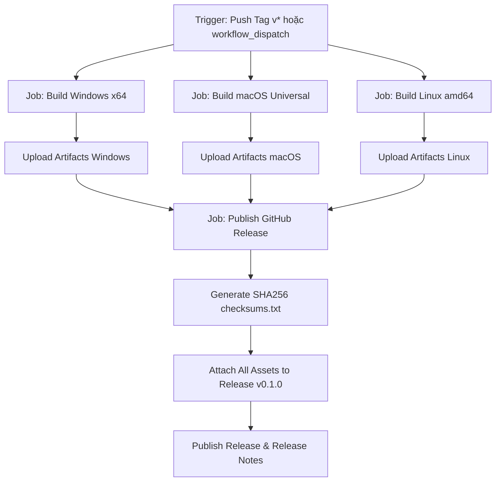

# Thiết Kế Đóng Gói Phát Hành Bản Release (Rust/Tauri) & Quy Trình Tạo GitHub PR (TouchPass v0.1.0)

## 1. Tổng Quan & Mục Tiêu

Dự án **TouchPass** đã phát triển hoàn chỉnh ứng dụng Desktop bằng **Rust + Tauri v2 + Svelte 5**, tích hợp các cơ chế bảo mật sinh trắc học phần cứng ESP32, mã hóa HMAC-AES-256, lưu trữ mật khẩu OS Keyring và giao diện hiện đại.

Mục tiêu của đợt phát hành này:
1. **Thiết lập GitHub Actions CI/CD Multi-Platform Release Workflow**: Tự động biên dịch, kiểm thử và đóng gói bộ cài đặt/file thực thi cho **Windows** (.exe NSIS, .msi, .zip portable), **macOS** (.dmg, .app, .tar.gz), và **Ubuntu Linux** (.deb, .AppImage, .tar.gz).
2. **Cơ chế phát hành GitHub Release**:
   - Tự động tạo Release kèm đính kèm đầy đủ file binary khi đẩy Git Tag (ví dụ `v0.1.0`, `v*`).
   - Hỗ trợ kích hoạt thủ công qua giao diện `workflow_dispatch` của GitHub Actions.
   - Tự động sinh mã băm kiểm tra toàn vẹn `checksums.txt` (SHA256).
3. **Chuẩn hóa Git & Tạo GitHub Pull Request**:
   - Cập nhật `.gitignore` loại bỏ `node_modules`, `target`, thư mục tạm.
   - Gom các tính năng của Desktop App (Rust Tauri + Svelte UI + tests + launcher + packaging) vào nhánh `feat/desktop-app-rust-release-v0.1.0`.
   - Đẩy lên GitHub remote và tạo Pull Request chính thức (`gh pr create`) kèm mô tả chi tiết, hướng dẫn cài đặt cho từng hệ điều hành.

---

## 2. Kiến Trúc CI/CD Multi-Platform Matrix

### 2.1 Ma Trận Biên Dịch (Build Matrix)

| Hệ điều hành | Runner GitHub | Dependencies / Cài đặt thêm | Định dạng phát hành (Release Assets) |
|---|---|---|---|
| **Windows x64** | `windows-latest` | Rust `stable-x86_64-pc-windows-msvc`, Node.js 24 | - `TouchPass_0.1.0_x64-setup.exe` (NSIS Installer)<br>- `TouchPass_0.1.0_x64_en-US.msi` (MSI)<br>- `TouchPass_0.1.0_windows_x64_portable.zip` |
| **macOS (Universal / Apple Silicon & Intel)** | `macos-latest` | Rust `stable-apple-darwin`, targets `x86_64-apple-darwin`, `aarch64-apple-darwin`, Node.js 24 | - `TouchPass_0.1.0_universal.dmg`<br>- `TouchPass_0.1.0_macos_universal.app.tar.gz` |
| **Ubuntu Linux x64** | `ubuntu-24.04` | `libwebkit2gtk-4.1-dev`, `libayatana-appindicator3-dev`, `librsvg2-dev`, `patchelf`, `libssl-dev` | - `touchpass_0.1.0_amd64.deb`<br>- `touchpass_0.1.0_amd64.AppImage`<br>- `TouchPass_0.1.0_linux_x64.tar.gz` |

### 2.2 Luồng Công Việc (Workflow Jobs)



---

## 3. Cấu Hình Chi Tiết Các Tệp Tin

### 3.1 Cập Nhật `.gitignore`
Đảm bảo các file rác và dependencies không bị commit:
- `software/desktop-app/node_modules/`
- `software/desktop-app/dist/`
- `software/desktop-app/src-tauri/target/`
- `software/desktop-app/src-tauri/gen/`

### 3.2 Workflow File `.github/workflows/release.yml`
- Kích hoạt khi `push: tags: ['v*']` hoặc `workflow_dispatch`.
- Chạy qua các bước:
  1. `actions/checkout@v4`
  2. Cài đặt Rust toolchain + targets tương ứng.
  3. Cài đặt các thư viện hệ thống (Linux: webkit2gtk, appindicator, etc.).
  4. Cài đặt Node dependencies và kiểm thử `npm test`, `cargo test`.
  5. Chạy `npm run tauri:build` để đóng gói.
  6. Gom các file kết quả vào thư mục release artifact và tính toán SHA256 checksum.
  7. Dùng `softprops/action-gh-release@v2` hoặc GitHub CLI để phát hành Release kèm asset files.

### 3.3 Workflow File `.github/workflows/desktop-app.yml` (CI Test & Verification)
- Dành cho Continuous Integration khi mở Pull Request hoặc push nhánh `main`.
- Đảm bảo mã nguồn trên mọi nền tảng không bị gãy trước khi merge.

---

## 4. Hướng Dẫn Sử Dụng Bản Release Cho Người Dùng

### Windows
1. Tải file `TouchPass_0.1.0_x64-setup.exe` hoặc bản portable `TouchPass_0.1.0_windows_x64_portable.zip`.
2. Chạy file cài đặt hoặc giải nén và mở trực tiếp `TouchPass.exe`.
3. Cắm thiết bị TouchPass ESP32 qua cổng USB và sử dụng.

### macOS
1. Tải file `TouchPass_0.1.0_universal.dmg`.
2. Mở file `.dmg`, kéo ứng dụng `TouchPass.app` vào thư mục `Applications`.
3. Mở ứng dụng (lần đầu tiên có thể cần cấp quyền hoặc chuột phải chọn *Open* nếu chưa ký notarization thương mại).

### Ubuntu / Linux
1. Tải file `.deb`:
   ```bash
   sudo dpkg -i touchpass_0.1.0_amd64.deb
   sudo apt-get install -f
   ```
2. Hoặc tải `.AppImage`:
   ```bash
   chmod +x touchpass_0.1.0_amd64.AppImage
   ./touchpass_0.1.0_amd64.AppImage
   ```

---

## 5. Kế Hoạch Tạo Branch & Pull Request

1. **Tạo Branch mới**: `feat/desktop-app-rust-release-v0.1.0` từ `main`.
2. **Commit các thành phần**:
   - Giao diện Desktop App Tauri v2 + Svelte 5 + Rust backend.
   - Bộ CI/CD Release Workflows đa nền tảng (`release.yml`, `desktop-app.yml`).
   - Launcher scripts & packaging tools.
   - Cập nhật `.gitignore` và tài liệu hướng dẫn.
3. **Đẩy Branch lên GitHub**: `git push origin feat/desktop-app-rust-release-v0.1.0`.
4. **Tạo GitHub Pull Request**: Sử dụng `gh pr create` với đầy đủ thông tin tóm tắt và hướng dẫn kiểm thử.
5. **Gắn Tag Release**: Sau khi tạo PR (hoặc khi merge), gắn tag `v0.1.0` để kích hoạt workflow đóng gói phát hành tự động.
