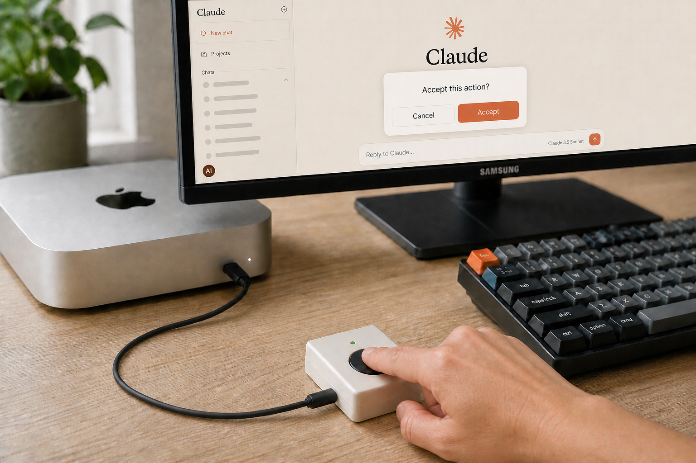
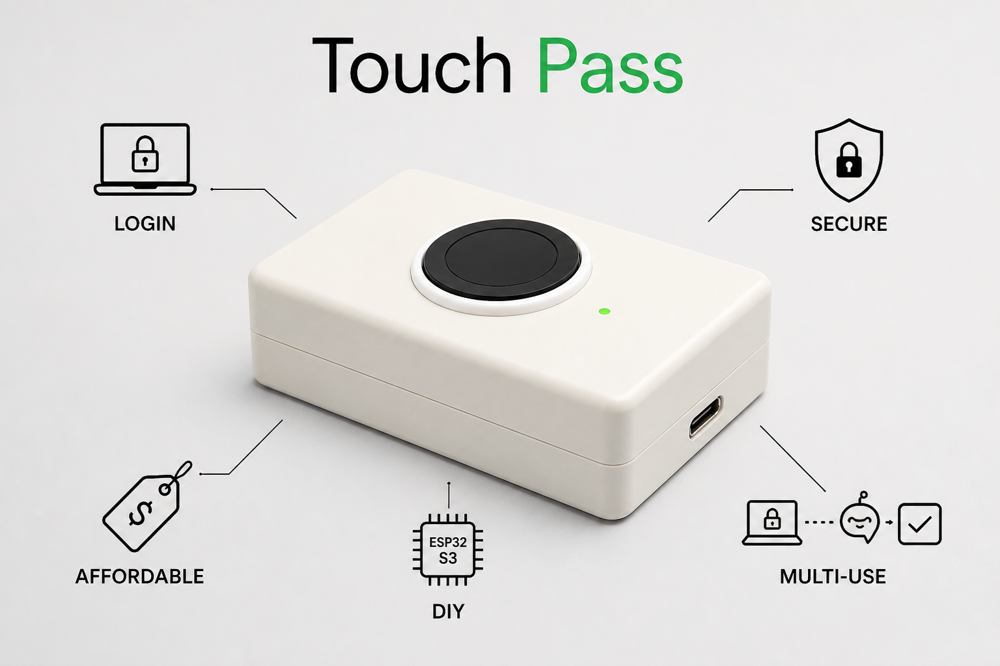

<div align="center">

# 🖐️ TouchPass

### *为每根手指赋予超级能力。*

[](../../LICENSE)
[](../BUILD_GUIDE.zh.md)
[-blueviolet.svg)](https://github.com/tody-agent/Touch-Pass/releases/download/v2.0.0/TouchPass.exe)
[](https://python.org)
[](https://tody-agent.github.io/Touch-Pass/web/flasher/)
[](../AI_AGENT_PROMPT.zh.md)
[](https://github.com/tody-agent/Touch-Pass/releases/tag/v2.0.0)

[🌐 **English**](../../README.md) | [🇻🇳 **Tiếng Việt**](README.vi.md) | 🇨🇳 **简体中文** | [📥 **下载 TouchPass.exe**](https://github.com/tody-agent/Touch-Pass/releases/download/v2.0.0/TouchPass.exe) | [🌐 **1-Click Web 刷机**](https://tody-agent.github.io/Touch-Pass/web/flasher/) | [🤖 **1-Prompt AI Agent 设置 (ZH)**](../AI_AGENT_PROMPT.zh.md)

<br />



> **工作原理：** 当您的终端 Prompt 请求确认许可时，轻触已注册的手指。TouchPass 将直接向当前 Focused 窗口发送原生 USB HID 键盘按键信号，自动输入 `y` 并按下 Enter。注意：TouchPass 发送的是原生 USB HID 键盘按键，无法点击或按压图形界面 (GUI) 按钮元素。

</div>

---

## ⚡ 问题 vs. 解决方案：专为 AI 开发者设计

### 🔴 问题：微小的打断会破坏深度工作状态
在与 AI Agent CLI 工具及 IDE（**Claude Code**、**Cursor**、**Antigravity**、**OpenCode**）协同编程时，您的工作流经常会被频繁的提示确认所打断：
> *"是否允许执行 `git status`？(y/n)"* 或 *`需要 Sudo 密码`*。

每 30 秒就需要切换上下文、重新调整双手位置、输入 `y` + `Enter` 或繁琐的密码，这极大地破坏了心流状态，浪费了宝贵的开发时间。

### 🟢 解决方案：物理硬件结合生物识别速度
**TouchPass** 将生物识别触控转化为物理键盘动作。硬件基于 **ESP32-S3 Super Mini** 微控制器与 **ZW101** 光学指纹传感器构建，让您可以为每根手指赋予专属的硬件超级能力：

- ☝️ **食指**：瞬间接受 AI 终端提示（输入 `y` 并回车）。
- 🖕 **中指**：安全地从 OS 凭据存储区提取并自动输入开发者的 `sudo` / SSH 凭据。
- 🖐️ **无名指**：触发多步骤快捷键宏（`Enter`、`Escape`、`Cmd+K` 或自定义按键序列）。

---

## 🎯 功能矩阵

| 功能特征 | 能力与架构说明 | 为 AI 工作流带来的优势 |
| :--- | :--- | :--- |
| 🌐 **Web Serial 刷机工具** | 在 Chrome/Edge 浏览器中基于 Web Serial API (`esptool-js`) 进行原生固件刷写 | 零安装开箱即用，直接通过浏览器刷写固件并附带 SHA-256 校验 |
| 🤖 **1-Prompt AI Agent 设置** | 可直接复制的 Prompt 模板，支持 **Claude Code**、**Cursor**、**Antigravity**、**OpenCode** | 1-Prompt 自动检测 OS 环境、创建 venv 虚拟环境、启动 Daemon 并完成硬件校验 |
| 🔌 **原生 USB HID 模拟** | 基于 ESP32-S3 协议栈模拟标准 USB 物理键盘硬件 | 在 Windows、macOS 和 Linux 上无需驱动程序，即插即用；向当前 **Focused（聚焦）** 窗口发送按键 |
| 🖐️ **10 个指纹槽位** | ZW101 光学生物识别传感器（槽位 01–10），芯片本地指纹比对 | 零云端依赖；为每根手指独立分配快捷宏或密码触发器 |
| ⌨️ **交互式快捷键录制器** | Web 门户界面（`http://127.0.0.1:8787/`），支持实时按键捕获与动作构建 | 数秒内即可配置单次 `key`、`text`、`delay`（毫秒）、`enter` 或 `escape` 动作序列 |
| 🚀 **1-Click 启动脚本** | 自动化的 Windows 批处理启动器（`start_touchpass.bat`）与 POSIX 脚本（`packaging/install.sh`） | 无缝启动本地 Flask 服务及串口 Serial 后台守护进程 |

---

## 🏗️ 架构与数据流

```text
┌─────────────────────────┐
│   生物识别传感器         │  指纹触摸 (ZW101)
│  (10 个已注册指纹 ID)   │
└───────────┬─────────────┘
            │ 本地指纹比对 (ID 01-10)
            ▼
┌─────────────────────────┐
│   ESP32-S3 硬件         │   HMAC-SHA256 挑战应答 / 串口 UART
│ (USB HID 键盘协议栈)     │ ◄═════════════════════════════════════════► ┌─────────────────────────┐
└───────────┬─────────────┘                                              │  TouchPass Portal 引擎  │
            │ 原生键盘按键输出                                           │  (Python Flask / Web UI)│
            ▼                                                            └───────────┬─────────────┘
┌─────────────────────────┐                                                          │ 安全凭据检索
│   宿主计算机窗口         │  自动输入 'y' + Enter / 密码 / 快捷宏                    ▼
│ (Claude Code, 终端等)   │ ◄───────────────────────────────────────────────── ┌─────────────────────────┐
└─────────────────────────┘                                                    │   OS 原生凭据存储区     │
                                                                               │(Win Credential/Keychain)│
                                                                               └─────────────────────────┘
```

---

## 🚀 快速入门指南

### 🌐 浏览器 Web 刷机（零安装）
访问 [🌐 **tody-agent.github.io/Touch-Pass/web/flasher/**](https://tody-agent.github.io/Touch-Pass/web/flasher/)，一键完成 ESP32-S3 固件刷写。

### 🤖 1-Prompt AI Agent 设置
将标准化设置 Prompt 提供给您的 AI 编程助手。详情请参阅 [🤖 **1-Prompt AI Agent 集成指南**](../AI_AGENT_PROMPT.zh.md)。

### Windows 环境
1. 下载 **[TouchPass.exe](https://github.com/tody-agent/Touch-Pass/releases/download/v2.0.0/TouchPass.exe)** 或克隆代码仓库：
   ```cmd
   git clone https://github.com/tody-agent/Touch-Pass.git
   cd Touch-Pass
   ```
2. 双击 **`TouchPass.exe`** 或运行 **`start_touchpass.bat`**：
   ```cmd
   .\start_touchpass.bat
   ```
3. 在浏览器中打开 `http://127.0.0.1:8787/` 访问 Web 门户。

### macOS / Linux 环境
1. 运行单行 POSIX 安装命令：
   ```bash
   curl -fsSL https://raw.githubusercontent.com/tody-agent/Touch-Pass/main/packaging/install.sh | bash
   ```
2. 在浏览器中打开 `http://127.0.0.1:8787/`。

---

## 🎬 功能亮点与视觉演示



- **自助式 4 步引导 (Onboarding)**：通过交互式硬件检测与自动串口发现，可在 5 分钟内快速配置上线。
- **双击确认安全防护 (Double-Touch Guard)**：非密码类动作需在 3 秒内连续触摸同一手指两次，防止误触操作。
- **零云端本地隐私与加密**：密码载荷在串口通信中采用基于 HMAC-SHA256 与 AES-CTR 加密，凭据存储受 OS 原生凭据库（Windows 凭据管理器 / macOS Keychain）保护。

---

## 📖 深度指南与文档

- 🤖 **[1-Prompt AI Agent 集成指南](../AI_AGENT_PROMPT.zh.md)** | **[🌐 English Version](../AI_AGENT_PROMPT.md)** | **[🇻🇳 Bản Tiếng Việt](../AI_AGENT_PROMPT.vi.md)**
  *针对 Windows、macOS 及 Linux 环境下的 Claude Code、Cursor、Antigravity、OpenCode 和 ChatGPT CLI 的 1-Prompt 自动化设置指南。*

- 🛠️ **[硬件构建与接线指南](../BUILD_GUIDE.zh.md)** | **[🌐 English Version](../BUILD_GUIDE.md)** | **[🇻🇳 Bản Tiếng Việt](../BUILD_GUIDE.vi.md)**
  *ESP32-S3 Super Mini 与 ZW101 接线图、外壳组装、`arduino-cli` 固件编译、未授权 UART 安全模型及 1-Click Windows 启动器设置。*

- 📖 **[用户指南与 AI 预设](../USER_GUIDE.zh.md)** | **[🌐 English Version](../USER_GUIDE.md)** | **[🇻🇳 Bản Tiếng Việt](../USER_GUIDE.vi.md)**
  *指纹录制流程、交互式快捷键录制器、双击安全规则、OS 凭据存储管理及故障排查。*

---

## 🙏 致谢与开源协议

TouchPass 是一款基于 **[MIT 许可证](../../LICENSE)** 开源的软件。

特别感谢并归功于 **[Zimeng Xiong](https://github.com/ZimengXiong)**（**[TinyTouch](https://github.com/ZimengXiong/TinyTouch)** 的原始创作者），其开源硬件生物识别 USB 架构使 TouchPass 成为可能。本项目基于 ZimengXiong/TinyTouch 代码库用 ❤️ 精心打造。

---

## 🛡️ 安全策略与法律声明 / Security Policy & Legal Disclaimer

TouchPass 按 **"原样"（"AS IS"）** 提供，不包含任何形式的明示或暗示保证。用户对物理硬件组装、接线图核对、电压等级（3.3V 与 5V 安全性）、光学生物识别传感器校准以及维护设备物理安全承担全部责任。TouchPass 直接与 OS 原生安全凭据库（Windows 凭据管理器 / macOS Keychain / Linux Secret Service）集成，并通过 Serial UART 使用 HMAC-SHA256 挑战应答机制进行通信。

TouchPass is provided **"AS IS"**, without warranty of any kind, express or implied. Users assume full responsibility for physical hardware assembly, wiring diagram verification, voltage levels (3.3V vs 5V safety), optical biometric sensor calibration, and maintaining physical device security.

TouchPass được cung cấp **"NGUYÊN TRẠNG" (AS IS)** và không có bất kỳ bảo hành nào. Người dùng tự chịu toàn bộ trách nhiệm đối với việc lắp ráp phần cứng vật lý, kiểm tra sơ đồ đấu nối dây, an toàn điện áp, hiệu chuẩn cảm biến vân tay quang học và bảo đảm an toàn truy cập vật lý cho thiết bị.

有关安全架构细节、受支持版本、漏洞报告流程和完整法律声明，请参阅我们的 **[安全策略与法律声明 (SECURITY.zh.md)](SECURITY.zh.md)** | **[SECURITY.md](../../SECURITY.md)**。
