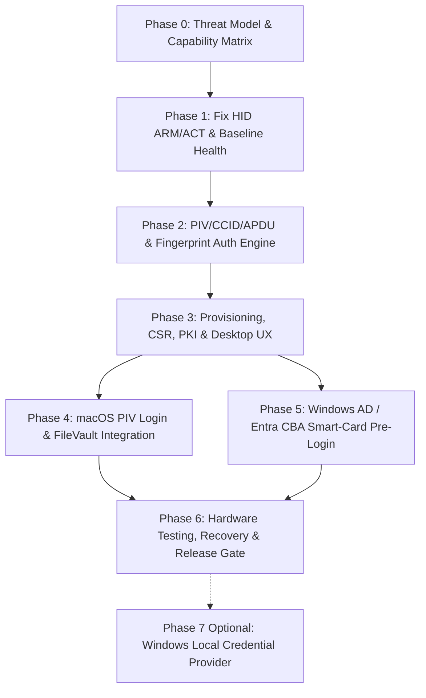

# Design: PIV Native Cold Boot Login Architecture

## 1. Context & Architectural Overview

The primary objective is to establish **PIV native (NIST SP 800-73-4 compliant CCID/Smart Card)** as the official cold boot and pre-login authentication mechanism for TouchPass, completely eliminating OS password storage from the ESP32-S3 firmware.

### Core Security Tenet
- **Zero OS Password Storage**: The firmware does NOT store OS login passwords in flash, NVS, or memory.
- **Asymmetric Cryptographic Proof**: Private keys (`9A` Authentication, `9E` Card Authentication) are generated and stored exclusively within the secure enclave / hardware-isolated boundary of the ESP32-S3 device.
- **Biometric Authorization Gate**: The physical ZW101 fingerprint sensor acts as the cryptographic activation switch (Match-on-Device). APDU private key signing operations require physical biometric authorization.
- **OS Native Cryptographic Verification**: The host OS (macOS / Windows) validates the identity via standard X.509 PKI certificates through its native CCID / Smart Card driver stack.

---

## 2. Evaluation of Feasibility Directions

| Strategy | Architecture | Security | Platform Support | Status |
| :--- | :--- | :--- | :--- | :--- |
| **Option 1: PIV Native** | USB CCID Smart Card (NIST SP 800-73-4) with hardware-bound keys & biometric release | **Highest** (asymmetric challenge-response, zero plaintext secrets) | macOS Apple Silicon (FileVault + Login), Apple T2 (Login window), Windows (Active Directory & Entra ID CBA) | **RECOMMENDED STANDARD** |
| **Option 2: PIV + Windows Custom Credential Provider** | PIV Native for macOS/Enterprise + Native C++ Windows Credential Provider DLL for Local Accounts | High, but large attack surface & complex maintenance | Full Windows Local Account support alongside PIV | **OPTIONAL (Phase 7)** |
| **Option 3: HID Password Keystroke Storage** | Firmware stores plaintext/reversible OS password and simulates USB keyboard keystrokes | **Low** (plaintext secret extraction risk, device theft compromise) | Universal HID keyboard | **REJECTED** |

### Platform Capability Matrix

- **macOS Apple Silicon (M1/M2/M3/M4)**: Full native support for CCID/PIV smart cards directly at **FileVault pre-boot** and Login Window.
- **macOS Apple T2 (Intel)**: Native FileVault unlock requires password/secure enclave; PIV smart cards are authenticated at the subsequent Login Window ([Apple Platform Deployment Reference](https://support.apple.com/en-gb/guide/deployment/dep806850525/web)).
- **Windows 10/11 Domain / Entra ID**: Native smart-card logon via Kerberos PKINIT or Microsoft Entra Certificate-Based Authentication (CBA) ([Microsoft Smart Card Logon Architecture](https://learn.microsoft.com/en-us/windows/security/identity-protection/smart-cards/smart-card-certificate-requirements-and-enumeration)).
- **Windows Local Accounts**: Windows PIV native architecture does not enumerate smart cards for non-domain local accounts by design. Local account login requires a custom Windows Credential Provider (deferred to Phase 7).

---

## 3. Phased Roadmap (OpenSpec Structure)

### Phase Breakdown

- **Phase 0: Threat Model, Capability Matrix & Recovery Strategy**
  - Threat vector analysis (physical loss, cold boot side-channel, MITM APDU).
  - Explicit capability matrix by OS version and hardware chip (Apple Silicon vs T2 vs Windows AD vs Local).
  - Disaster recovery protocols (admin unlock, pairing recovery, PUK/PIN reset without bricking).

- **Phase 1: HID ARM/ACT Fixes & Baseline Operational Stability**
  - Stabilize existing HID automation pipeline.
  - Complete HMAC-SHA256 session handshake and payload encryption verification across helper and firmware.

- **Phase 2: PIV / CCID / APDU Firmware Core & Biometric Gate**
  - NIST SP 800-73-4 compliant APDU dispatch (`SELECT`, `GET DATA`, `VERIFY`, `GENERAL AUTHENTICATE`).
  - Key slot mapping: `9A` (PIV Authentication), `9E` (Card Authentication), `9C` (Digital Signature).
  - Match-on-Device fingerprint verification releasing single-use or session-bound cryptographic signature permissions.
  - Hardware RNG and mbedTLS ECC / RSA acceleration.

- **Phase 3: Certificate Provisioning, CSR Generation & Desktop Management UX**
  - Host desktop tooling (Tauri / Rust) for PIV certificate enrollment and CSR signing.
  - Certificate import into `9A`/`9E` slots and CHUID generation.
  - User feedback during enrollment, biometric authorization tests, and health indicators.

- **Phase 4: macOS PIV Login & FileVault Integration**
  - `sc_auth` pairing and smart-card token profile configuration.
  - Validation of FileVault pre-boot unlock on Apple Silicon.
  - Fallback and diagnostics for Apple T2 login window workflows.

- **Phase 5: Windows AD / Microsoft Entra CBA Smart-Card Pre-Login**
  - Smart Card Minidriver / Class Driver compatibility verification.
  - User Principal Name (UPN) / Subject Alternative Name (SAN) mapping for AD PKINIT and Entra CBA.
  - Windows Logon Screen pre-login enrollment validation.

- **Phase 6: Hardware Verification, Recovery Gates & Changelog**
  - Multi-platform physical device test matrix execution.
  - Recovery simulation (lost device, damaged fingerprint, revoked certificate).
  - Strict Quality Gate & Approval checkpoint before release tags.

- **Phase 7 (Optional Extension): Windows Custom Credential Provider for Local Accounts**
  - Custom C++ `ICredentialProviderCredential2` DLL.
  - Inter-process communication bridge to TouchPass USB CCID/HID.
  - Secure Desktop rendering, code signing, anti-lockout safety nets.

---

## 4. Superpowers Engineering Process & Quality Gates

1. **Cycle per Phase**: `planning` → `TDD (Red-Green)` → `implementation` → `code review` → `quality gate`.
2. **Strict Test Discipline**: Failing test (Red) written and validated before implementation (Green).
3. **Approval Gates**: Mandatory user/maintainer approval before:
   - Flashing physical firmware to target boards.
   - Enforcing system-level FileVault / Smart Card lockdown policies.
   - Merging release branches and tagging builds.
4. **Hardware Verification Rule**: No platform support is declared or documented until verified on actual physical hardware.
5. **Session Continuity**: Multi-session handoff context buses maintain persistent state across phases.
